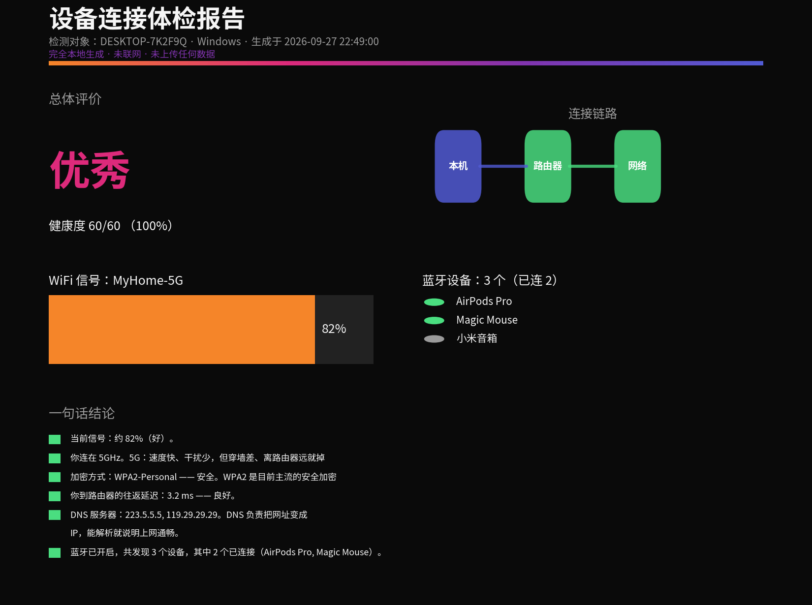

# 设备连接体检 · Device Net Insight

一个 **CodeBuddy / Agent Skill**：本地查询你电脑的 **网络 / WiFi / 蓝牙** 详细数据，
用大白话做分析，并渲染一张 Ins 风暗色仪表盘图片 + 一份通俗文字报告。
全程在本机运行，**不联网、不上传任何数据**。

> 适合对计算机不太熟、想「用人话看懂自己网络连接状态」的人。

---

## 🖼️ 效果预览



> 跑完直接双击就得到这样一张 Ins 风暗色仪表盘，外加一份「大白话」文字报告。
> 不用懂 dBm、信道、DNS 这些名词，图上每一条都是人话结论。

---

## ✨ 功能

- **网络**：网卡、IPv4/IPv6、MAC、网关、DNS、到路由器延迟
- **WiFi**：SSID、信号强度（dBm / 百分比）、频段（2.4/5/6G）、信道、加密方式
- **蓝牙**：开关状态、已配对 / 已连接设备清单
- 一条命令 → 自动采集 + 分析 + 渲染（PNG 仪表盘 + TXT 大白话报告）
- 读不到真机时，支持「用户提供数据」模式出图（**绝不编造**任何字段）

## 🔒 隐私承诺

- 只读取设备**自身**系统状态（网卡 / WiFi / 蓝牙），不读凭据、不碰文件内容。
- **零网络外联**：采集时只 `ping` 本地路由器 / DNS（局域网内），不访问互联网。
- 生成的图片、JSON、报告全部落在你指定的**本地目录**。
- 手动模式下未填写的项显示「未提供」，不会被误判成故障。

## 📦 安装

把本目录整体放入你的 skills 目录即可，例如：

```bash
# CodeBuddy
cp -r device-net-insight ~/.codebuddy/skills/

# 其他兼容 Agent Skills 的客户端，放到其 skills 目录下
```

新对话即自动触发，无需手动开启。

## 🚀 使用

### 方式 A：在你自己的电脑上跑（推荐，数据最全）

- **Windows（最省事）**：打开文件管理器 → 进入本目录 → **双击 `一键体检.bat`**
  （自动找 Python、缺 `matplotlib` 自动装、跑完自动弹出「结果」文件夹）。
- **macOS / Linux**：打开终端，粘贴执行

  ```bash
  python3 scripts/device_net_insight.py all -o ./结果
  ```

跑完在「结果」文件夹里：
- 双击 `连接体检仪表盘_*.png` 看体检图
- 双击 `连接体检报告_*.txt` 看大白话文字版

### 方式 B：云端 / 移动端读不到真机时

当 skill 运行在云端沙箱、或你在手机 / iPad 上（够不到本机数据时），
AI 会请**你**把信息发来（你给多少分析多少，没给的绝不瞎编）：

1. **IP 地址（最重要）**：Windows 按 `Win+R` → 输入 `cmd` 回车 → 敲 `ipconfig` → 看「IPv4 地址」
2. 网关 / DNS（同一 `ipconfig` 里就有）
3. WiFi 名称、信号百分比
4. 已连接的蓝牙设备名

也可以直接把 `ipconfig /all` 和 `netsh wlan show interfaces` 整段粘给 AI。
AI 用 `manual` 子命令解析并出图，图片与报告会标注「以下数据由你提供（非本机自动读取）」。

## 🧰 命令行参考

```bash
python3 scripts/device_net_insight.py collect  -o ./结果   # 仅采集 → scan.json
python3 scripts/device_net_insight.py render   -i ./结果/scan.json -o ./结果  # 仅分析+渲染
python3 scripts/device_net_insight.py all      -o ./结果   # 采集 + 分析 + 渲染
python3 scripts/device_net_insight.py manual --text  "<粘贴内容>" -o ./结果   # 用户提供数据出图
python3 scripts/device_net_insight.py manual --json  用户数据.json   -o ./结果
```

## 📁 目录结构

```
device-net-insight/
├── SKILL.md                 # 技能定义（触发条件、工作流、给用户的说明）
├── README.md                # 本文件
├── LICENSE                  # MIT 许可证
├── 一键体检.bat              # Windows 双击启动器
├── preview.png              # 仪表盘效果预览图
├── device_net_insight.py    # 采集 + 分析 + 渲染主程序
└── metrics_guide.md         # 各指标的通俗解释对照表
```

## 📋 依赖

- Python 3.8+
- 采集用标准库；渲染需要 `matplotlib`：`pip install matplotlib`

## 🖥️ 平台说明

- **Windows**：`ipconfig` / `netsh wlan` / `ping` / PowerShell `Get-PnpDevice`
- **macOS**：`networksetup` / `airport` / `ifconfig` / `system_profiler` / `route` / `scutil`
- **Linux**：`ip` / `nmcli` / `iwgetid` / `resolvectl` / `bluetoothctl`（缺命令自动降级）

> 说明：移动端 app（如 iPad）不提供网络 / WiFi / 蓝牙读取接口，无法直接自动采集；
> 这类设备请用系统「设置」查看，或改在电脑端运行本 skill。

## 📄 License

本项目基于 [MIT 许可证](./LICENSE) 开源，详见仓库内 `LICENSE` 文件。
